# Computer Graphics and Multimedia System Lab (CSE41P8)

All experiments implemented in **C++** (WinBGIm) and **Python** (matplotlib).

---

## Run Instructions

```bash
# ── C++ (requires WinBGIm setup) ──
.\setup.ps1          # One-time setup
.\run.ps1 2          # Run experiment 2 (experiment number 2-13)
.\menu.ps1           # Interactive menu

# ── Python (requires matplotlib) ──
pip install matplotlib pillow
python exp02_slope_intercept.py   # Replace with any exp*.py
```

---

## Experiment 2: Line Drawing using Slope-Intercept Formula

**Files:** `exp02_slope_intercept.cpp` · `exp02_slope_intercept.py`

### Theory

The slope-intercept form of a line: **y = mx + c**

- **m** = slope = (y₂ - y₁) / (x₂ - x₁)
- **c** = y-intercept = y₁ - m × x₁

If |dx| ≥ |dy|, iterate over x and compute y = round(m·x + c).  
Otherwise, iterate over y and compute x = round((y - c) / m).

### Python Code

```python
import matplotlib.pyplot as plt

def slope_intercept_line(x1, y1, x2, y2):
    dx, dy = x2 - x1, y2 - y1
    if dx == 0:
        y_start = min(y1, y2)
        y_end = max(y1, y2)
        return [(x1, y) for y in range(y_start, y_end + 1)], 0, 0

    m = dy / dx
    c = y1 - m * x1
    pixels = []

    if abs(dx) >= abs(dy):
        x_start = min(x1, x2)
        x_end = max(x1, x2)
        for x in range(x_start, x_end + 1):
            y_exact = m * x + c
            pixels.append((x, round(y_exact)))
    else:
        y_start = min(y1, y2)
        y_end = max(y1, y2)
        for y in range(y_start, y_end + 1):
            x_exact = (y - c) / m
            pixels.append((round(x_exact), y))

    return pixels, m, c


def run():
    x1, y1 = 100, 100
    x2, y2 = 400, 300
    result = slope_intercept_line(x1, y1, x2, y2)
    pixels, m, c = result

    fig, ax = plt.subplots(figsize=(8, 6))
    ax.set_title("Slope-Intercept: y = mx + c")

    xs, ys = zip(*pixels)
    ax.scatter(xs, ys, c="yellow", s=30, label="Line pixels", zorder=3)
    ax.plot([x1, x2], [y1, y2], "r--", linewidth=1, alpha=0.5, label="True line")

    ax.scatter([x1, x2], [y1, y2], c="red", s=80, zorder=4)
    ax.annotate(f"A({x1},{y1})", (x1, y1), xytext=(8, 5),
                textcoords="offset points", color="red", fontsize=9)
    ax.annotate(f"B({x2},{y2})", (x2, y2), xytext=(8, 5),
                textcoords="offset points", color="red", fontsize=9)

    dx, dy = x2 - x1, y2 - y1
    info = (
        f"dx = {dx}   dy = {dy}\n"
        f"m = dy/dx = {dy}/{dx} = {m:.2f}\n"
        f"c = y1 - m*x1 = {y1} - ({m:.2f})*{x1} = {c:.2f}\n"
        f"Equation: y = {m:.2f}x + {c:.2f}"
    )
    ax.text(0.02, 0.98, info, transform=ax.transAxes,
            fontsize=9, verticalalignment="top",
            bbox=dict(boxstyle="round", facecolor="wheat", alpha=0.8))

    ax.set_xlabel("X")
    ax.set_ylabel("Y")
    ax.grid(True, alpha=0.3)
    ax.legend(fontsize=9)
    ax.set_aspect("equal")
    plt.tight_layout()
    plt.show()

if __name__ == "__main__":
    run()
```

### Output

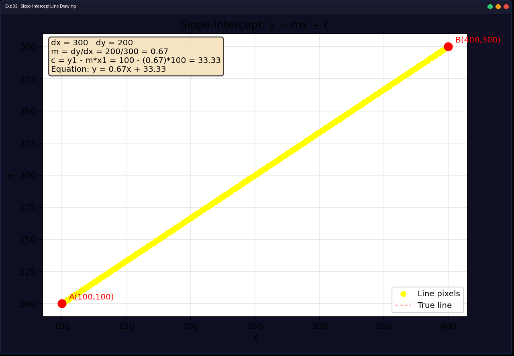

---

## Experiment 3: Line Drawing using DDA Algorithm

**Files:** `exp03_dda_line.cpp` · `exp03_dda_line.py`

### Theory

Digital Differential Analyzer increments both x and y by fractional steps. The number of steps = max(|dx|, |dy|). At each step, x += x_inc, y += y_inc, and we plot round(x), round(y).

### Python Code

```python
import matplotlib.pyplot as plt

def dda_line(x1, y1, x2, y2):
    dx = x2 - x1
    dy = y2 - y1
    steps = max(abs(dx), abs(dy))
    x_inc = dx / steps
    y_inc = dy / steps

    x, y = float(x1), float(y1)
    pixels = []
    for _ in range(steps + 1):
        pixels.append((round(x), round(y)))
        x += x_inc
        y += y_inc
    return pixels


def run():
    x1, y1 = 100, 100
    x2, y2 = 400, 300
    pixels = dda_line(x1, y1, x2, y2)

    fig, ax = plt.subplots(figsize=(8, 6))
    ax.set_title("DDA Line Algorithm: Digital Differential Analyzer")

    xs, ys = zip(*pixels)
    ax.scatter(xs, ys, c="yellow", s=30, label="DDA Pixels", zorder=3)
    ax.plot([x1, x2], [y1, y2], "r--", linewidth=1, alpha=0.5, label="True line")

    ax.scatter([x1, x2], [y1, y2], c="red", s=80, zorder=4)
    ax.annotate(f"A({x1},{y1})", (x1, y1), xytext=(8, 5), textcoords="offset points", color="red", fontsize=9)
    ax.annotate(f"B({x2},{y2})", (x2, y2), xytext=(8, 5), textcoords="offset points", color="red", fontsize=9)

    dx, dy = x2 - x1, y2 - y1
    steps = max(abs(dx), abs(dy))
    x_inc = dx / steps
    y_inc = dy / steps

    info = (
        f"dx = {dx}   dy = {dy}\n"
        f"steps = max(|dx|,|dy|) = {steps}\n"
        f"x_inc = dx/steps = {dx}/{steps} = {x_inc:.2f}\n"
        f"y_inc = dy/steps = {dy}/{steps} = {y_inc:.2f}"
    )
    ax.text(0.02, 0.98, info, transform=ax.transAxes, fontsize=9,
            verticalalignment="top",
            bbox=dict(boxstyle="round", facecolor="wheat", alpha=0.8))

    ax.set_xlabel("X")
    ax.set_ylabel("Y")
    ax.grid(True, alpha=0.3)
    ax.legend(fontsize=9)
    ax.set_aspect("equal")
    plt.tight_layout()
    plt.show()

if __name__ == "__main__":
    run()
```

### Output

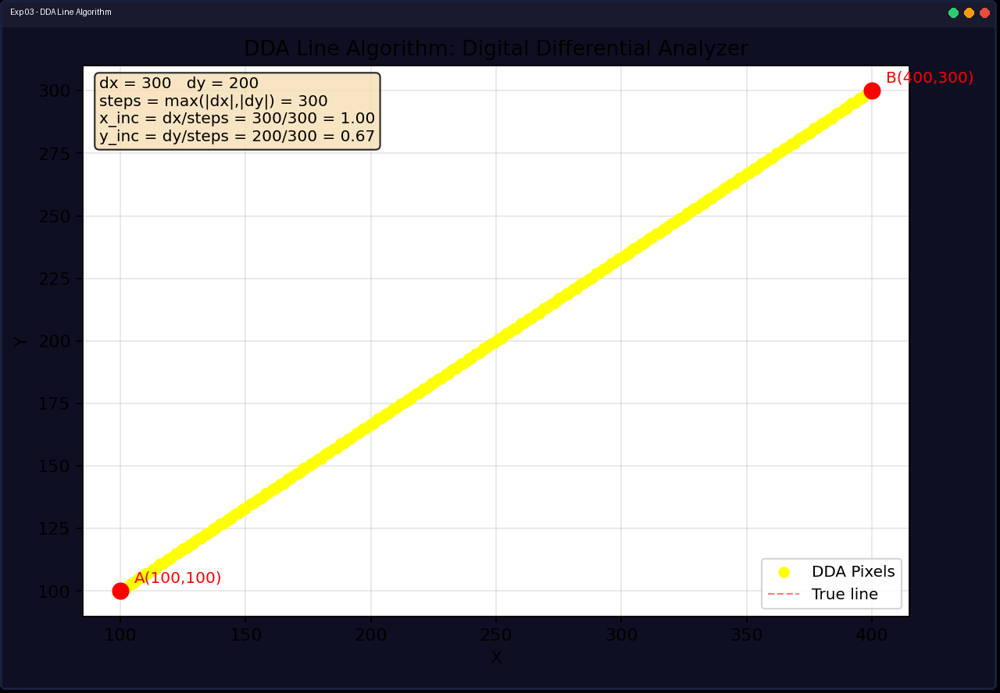

---

## Experiment 4: Line Drawing using Bresenham's Algorithm

**Files:** `exp04_bresenham_line.cpp` · `exp04_bresenham_line.py`

### Theory

Bresenham's algorithm uses only **integer arithmetic**. A decision parameter `p = 2·dy - dx` determines which pixel is closer to the true line. Works in all 8 octants by tracking direction (sx, sy) and optionally swapping axes for steep slopes.

### Python Code

```python
import matplotlib.pyplot as plt

def bresenham_line(x1, y1, x2, y2):
    dx = abs(x2 - x1)
    dy = abs(y2 - y1)
    sx = 1 if x1 < x2 else -1
    sy = 1 if y1 < y2 else -1

    swapped = 0
    if dy > dx:
        dx, dy = dy, dx
        swapped = 1

    p = 2 * dy - dx
    x, y = x1, y1
    pixels = []

    for _ in range(dx + 1):
        pixels.append((x, y))
        while p >= 0:
            if swapped:
                x += sx
            else:
                y += sy
            p -= 2 * dx
        if swapped:
            y += sy
        else:
            x += sx
        p += 2 * dy

    return pixels


def run():
    cx, cy = 300, 200
    endpoints = [
        (cx, cy, cx + 150, cy), (cx, cy, cx + 100, cy - 80),
        (cx, cy, cx, cy - 150), (cx, cy, cx - 100, cy - 80),
        (cx, cy, cx - 150, cy), (cx, cy, cx - 100, cy + 80),
        (cx, cy, cx, cy + 150), (cx, cy, cx + 100, cy + 80),
    ]

    fig, ax = plt.subplots(figsize=(8, 6))
    ax.set_title("Bresenham Line Algorithm (Integer Arithmetic)")

    colors = plt.cm.tab10.colors
    for i, (x1, y1, x2, y2) in enumerate(endpoints):
        pixels = bresenham_line(x1, y1, x2, y2)
        xs, ys = zip(*pixels)
        ax.scatter(xs, ys, color=colors[i % len(colors)], s=20, zorder=3)

    ax.scatter([cx], [cy], c="red", s=100, zorder=4, marker="o")
    ax.annotate(f"Center ({cx},{cy})", (cx, cy), xytext=(8, 5),
                textcoords="offset points", color="red", fontsize=9, fontweight="bold")

    ax.text(0.02, 0.98, "Bresenham's Line Algorithm\nLines in all 8 octants from center",
            transform=ax.transAxes, fontsize=10, verticalalignment="top",
            bbox=dict(boxstyle="round", facecolor="lightcyan", alpha=0.8))

    ax.set_xlabel("X")
    ax.set_ylabel("Y")
    ax.grid(True, alpha=0.3)
    ax.set_aspect("equal")
    plt.tight_layout()
    plt.show()

if __name__ == "__main__":
    run()
```

### Output

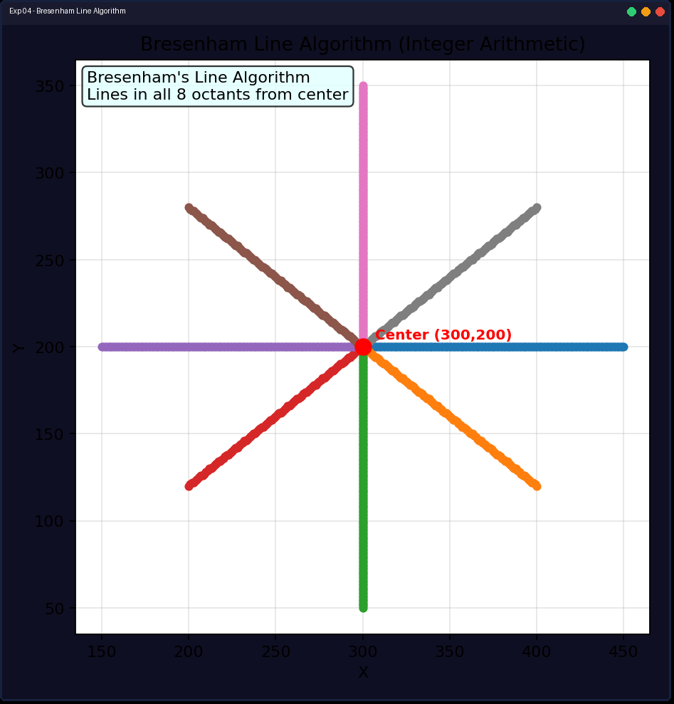

---

## Experiment 5: Midpoint Circle Algorithm

**Files:** `exp05_midpoint_circle.cpp` · `exp05_midpoint_circle.py`

### Theory

Uses the implicit circle equation `f(x,y) = x² + y² - r²`. With **8-way symmetry**, only 1/8 of the circle needs to be computed. Decision parameter `p = 1 - r` determines whether to plot E or SE pixel.

### Python Code

```python
import matplotlib.pyplot as plt

def plot_circle_points(ax, xc, yc, x, y):
    pts = [
        (xc + x, yc + y), (xc - x, yc + y),
        (xc + x, yc - y), (xc - x, yc - y),
        (xc + y, yc + x), (xc - y, yc + x),
        (xc + y, yc - x), (xc - y, yc - x),
    ]
    xs, ys = zip(*pts)
    ax.scatter(xs, ys, c="yellow", s=15, zorder=3)


def midpoint_circle(xc, yc, r):
    x, y = 0, r
    p = 1 - r
    pixels = [(x, y)]
    while x < y:
        x += 1
        if p < 0:
            p += 2 * x + 3
        else:
            y -= 1
            p += 2 * (x - y) + 5
        pixels.append((x, y))
    return pixels


def run():
    fig, ax = plt.subplots(figsize=(8, 6))
    ax.set_title("Midpoint Circle Algorithm (Bresenham's Circle)")
    ax.set_xlim(100, 500)
    ax.set_ylim(0, 400)
    ax.set_aspect("equal")
    ax.grid(True, alpha=0.3)

    for r in [50, 100, 150]:
        pixels = midpoint_circle(0, 0, r)
        for x, y in pixels:
            plot_circle_points(ax, 300, 200, x, y)

    ax.text(0.02, 0.98,
            "Midpoint Circle Algorithm (Bresenham's Circle)\n"
            "Concentric circles: r = 50, 100, 150",
            transform=ax.transAxes, fontsize=10, verticalalignment="top",
            bbox=dict(boxstyle="round", facecolor="lightcyan", alpha=0.8))

    ax.set_xlabel("X")
    ax.set_ylabel("Y")
    plt.tight_layout()
    plt.show()

if __name__ == "__main__":
    run()
```

### Output

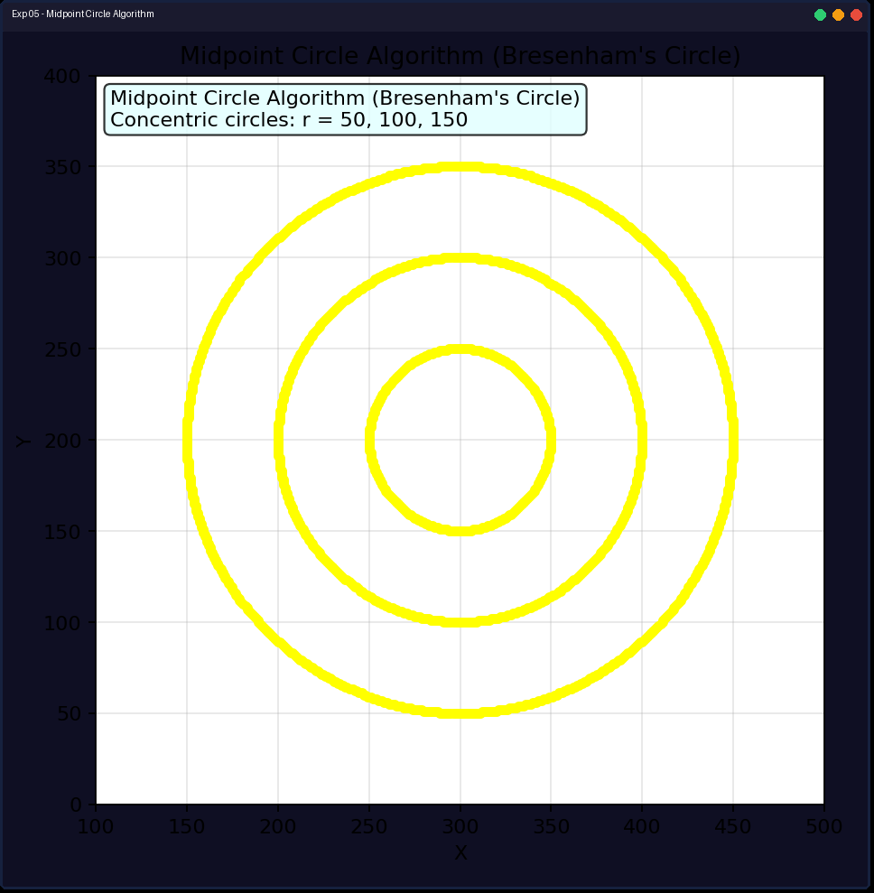

---

## Experiment 6: 2D Translation

**Files:** `exp06_translation.cpp` · `exp06_translation.py`

### Theory

Translation moves every point by the same vector: `x' = x + tx, y' = y + ty`. In matrix form using homogeneous coordinates:

```
| x' |   | 1 0 tx | | x |
| y' | = | 0 1 ty | | y |
| 1  |   | 0 0 1  | | 1 |
```

### Python Code

```python
import matplotlib.pyplot as plt
import matplotlib.patches as mpatches

def draw_triangle(ax, x1, y1, x2, y2, x3, y3, color, label=None):
    triangle = mpatches.Polygon(
        [(x1, y1), (x2, y2), (x3, y3)],
        fill=False, edgecolor=color, linewidth=2, label=label
    )
    ax.add_patch(triangle)


def run():
    fig, (ax1, ax2) = plt.subplots(1, 2, figsize=(12, 5))

    # ---- Part 1: Translate a LINE ----
    ax1.set_title("2D Translation: Line")
    ax1.set_xlim(0, 420)
    ax1.set_ylim(0, 300)
    ax1.set_aspect("equal")
    ax1.grid(True, alpha=0.3)

    lx1, ly1 = 50, 50
    lx2, ly2 = 200, 150
    tx, ty = 100, 80

    ax1.plot([lx1, lx2], [ly1, ly2], "w-", linewidth=2, label="Original Line")
    ax1.plot([lx1 + tx, lx2 + tx], [ly1 + ty, ly2 + ty],
             "y-", linewidth=2, label=f"Translated (tx={tx}, ty={ty})")
    ax1.scatter([lx1, lx2], [ly1, ly2], c="white", s=40, zorder=4)
    ax1.scatter([lx1 + tx, lx2 + tx], [ly1 + ty, ly2 + ty], c="yellow", s=40, zorder=4)
    ax1.annotate("Original", (lx1, ly1), xytext=(5, 8), textcoords="offset points", color="white", fontsize=8)
    ax1.annotate("Translated", (lx1 + tx, ly1 + ty), xytext=(5, 8), textcoords="offset points", color="yellow", fontsize=8)

    # ---- Part 2: Translate a TRIANGLE ----
    ax2.set_title("2D Translation: Triangle")
    ax2.set_xlim(150, 600)
    ax2.set_ylim(0, 350)
    ax2.set_aspect("equal")
    ax2.grid(True, alpha=0.3)

    x1, y1 = 300, 200
    x2, y2 = 400, 50
    x3, y3 = 200, 50
    ttx, tty = 150, 100

    draw_triangle(ax2, x1, y1, x2, y2, x3, y3, "white", "Original Triangle")
    draw_triangle(ax2, x1 + ttx, y1 + tty, x2 + ttx, y2 + tty,
                  x3 + ttx, y3 + tty, "cyan", f"Translated (tx={ttx}, ty={tty})")
    ax2.scatter([x1, x2, x3], [y1, y2, y3], c="white", s=40, zorder=4)
    ax2.scatter([x1 + ttx, x2 + ttx, x3 + ttx],
                [y1 + tty, y2 + tty, y3 + tty], c="cyan", s=40, zorder=4)
    ax2.annotate("Original", (x1, y1), xytext=(5, 8), textcoords="offset points", color="white", fontsize=8)
    ax2.annotate("Translated", (x1 + ttx, y1 + tty), xytext=(5, 8), textcoords="offset points", color="cyan", fontsize=8)

    for ax in [ax1, ax2]:
        ax.set_xlabel("X")
        ax.set_ylabel("Y")
        ax.legend(fontsize=8, loc="lower right")
        ax.set_facecolor("#2b2b2b")
        ax.tick_params(colors="white")
        ax.xaxis.label.set_color("white")
        ax.yaxis.label.set_color("white")
        ax.title.set_color("white")

    fig.patch.set_facecolor("#2b2b2b")
    plt.tight_layout()
    plt.show()

if __name__ == "__main__":
    run()
```

### Output

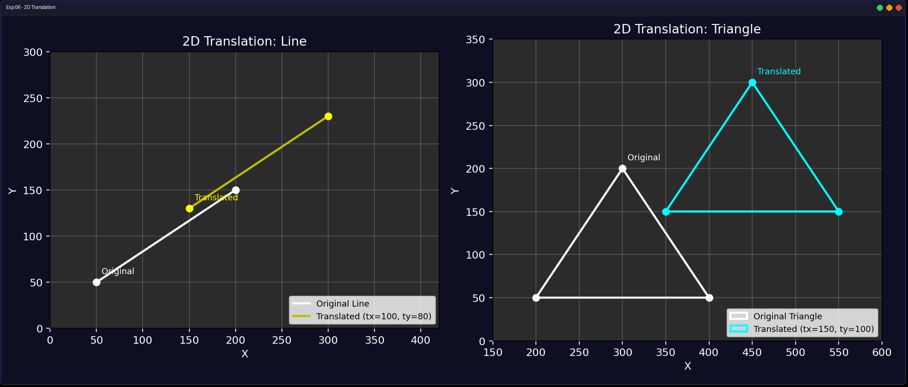

---

## Experiment 7: 2D Rotation

**Files:** `exp07_rotation.cpp` · `exp07_rotation.py`

### Theory

Rotation about pivot (cx, cy) by angle θ:

```
x' = cx + (x-cx)·cosθ - (y-cy)·sinθ
y' = cy + (x-cx)·sinθ + (y-cy)·cosθ
```

### Python Code

```python
import math
import matplotlib.pyplot as plt
import matplotlib.patches as mpatches

def rotate_point(x, y, cx, cy, angle):
    rad = math.radians(angle)
    cos_a, sin_a = math.cos(rad), math.sin(rad)
    x_rel, y_rel = x - cx, y - cy
    x_rot = x_rel * cos_a - y_rel * sin_a
    y_rot = x_rel * sin_a + y_rel * cos_a
    return round(cx + x_rot), round(cy + y_rot)

def draw_triangle(ax, x1, y1, x2, y2, x3, y3, color, label=None):
    tri = mpatches.Polygon(
        [(x1, y1), (x2, y2), (x3, y3)],
        fill=False, edgecolor=color, linewidth=2, label=label
    )
    ax.add_patch(tri)

def run():
    fig, (ax1, ax2) = plt.subplots(1, 2, figsize=(12, 5.5))
    fig.suptitle("2D Rotation Transformation", fontsize=13)

    # Part 1: Rotate a LINE
    ax1.set_title("Rotation: Line")
    ax1.set_xlim(50, 350); ax1.set_ylim(200, 380)
    ax1.set_aspect("equal"); ax1.grid(True, alpha=0.3)

    lx1, ly1, lx2, ly2 = 100, 300, 250, 300
    ax1.plot([lx1, lx2], [ly1, ly2], "w-", linewidth=2, label="Original")
    ax1.scatter([lx1], [ly1], c="red", s=50, zorder=4)

    for deg, color, label in [(45, "yellow", "Rotated 45"), (90, "lime", "Rotated 90")]:
        rx, ry = rotate_point(lx2, ly2, lx1, ly1, deg)
        ax1.plot([lx1, rx], [ly1, ry], color=color, linewidth=2, label=label)
        ax1.scatter([rx], [ry], c=color, s=40, zorder=4)
        ax1.annotate(label, (rx, ry), xytext=(5, 5), textcoords="offset points", color=color, fontsize=8)
    ax1.annotate("Pivot", (lx1, ly1), xytext=(5, 8), textcoords="offset points", color="red", fontsize=8)

    # Part 2: Rotate a TRIANGLE
    ax2.set_title("Rotation: Triangle")
    ax2.set_xlim(200, 600); ax2.set_ylim(0, 350)
    ax2.set_aspect("equal"); ax2.grid(True, alpha=0.3)

    x1, y1, x2, y2, x3, y3 = 400, 80, 500, 200, 300, 200
    cx = (x1 + x2 + x3) // 3
    cy = (y1 + y2 + y3) // 3

    draw_triangle(ax2, x1, y1, x2, y2, x3, y3, "white", "Original")
    ax2.scatter([cx], [cy], c="red", s=50, zorder=4)
    ax2.annotate("Centroid", (cx, cy), xytext=(5, 8), textcoords="offset points", color="red", fontsize=8)

    for deg, color, label in [(60, "magenta", "Rotated 60"), (120, "cyan", "Rotated 120")]:
        r = [rotate_point(x1, y1, cx, cy, deg), rotate_point(x2, y2, cx, cy, deg), rotate_point(x3, y3, cx, cy, deg)]
        draw_triangle(ax2, r[0][0], r[0][1], r[1][0], r[1][1], r[2][0], r[2][1], color, label)

    for ax in [ax1, ax2]:
        ax.set_xlabel("X"); ax.set_ylabel("Y")
        ax.legend(fontsize=7, loc="lower right")
        ax.set_facecolor("#2b2b2b"); ax.tick_params(colors="white")
        ax.xaxis.label.set_color("white"); ax.yaxis.label.set_color("white")
        ax.title.set_color("white")

    fig.patch.set_facecolor("#2b2b2b")
    plt.tight_layout()
    plt.show()

if __name__ == "__main__":
    run()
```

### Output

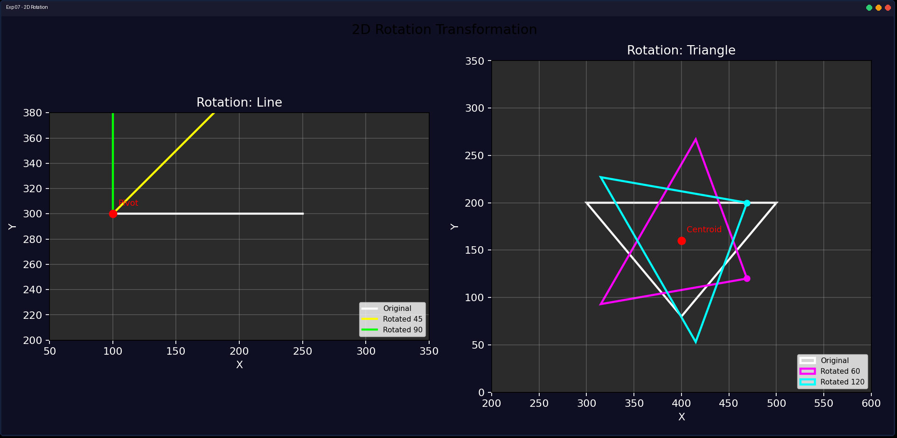

---

## Experiment 8: 2D Scaling

**Files:** `exp08_scaling.cpp` · `exp08_scaling.py`

### Theory

Scaling about fixed point (fx, fy): `x' = fx + (x-fx)·sx, y' = fy + (y-fy)·sy`

- Uniform scaling: sx = sy (preserves proportions)
- Differential scaling: sx ≠ sy (distorts shape)

### Python Code

```python
import matplotlib.pyplot as plt
import matplotlib.patches as mpatches

def scale_point(x, y, fx, fy, sx, sy):
    return round(fx + (x - fx) * sx), round(fy + (y - fy) * sy)

def draw_triangle(ax, x1, y1, x2, y2, x3, y3, color, label=None):
    tri = mpatches.Polygon([(x1, y1), (x2, y2), (x3, y3)], fill=False, edgecolor=color, linewidth=2, label=label)
    ax.add_patch(tri)

def run():
    fig, (ax1, ax2) = plt.subplots(1, 2, figsize=(12, 5.5))
    fig.suptitle("2D Scaling Transformation", fontsize=13)

    # Part 1: Scale a RECTANGLE
    ax1.set_title("Scaling: Rectangle")
    ax1.set_xlim(0, 350); ax1.set_ylim(0, 300)
    ax1.set_aspect("equal"); ax1.grid(True, alpha=0.3)

    rx1, ry1, rx2, ry2 = 50, 50, 150, 150
    fx, fy = (rx1 + rx2) // 2, (ry1 + ry2) // 2

    ax1.add_patch(mpatches.Rectangle((rx1, ry1), rx2 - rx1, ry2 - ry1, fill=False, edgecolor="white", linewidth=2, label="Original"))

    for sx, sy, color, label in [
        (1.5, 1.5, "yellow", "Scaled 1.5x (uniform)"),
        (2.0, 0.5, "cyan", "Scaled (2x, 0.5x) (differential)")
    ]:
        p1 = scale_point(rx1, ry1, fx, fy, sx, sy)
        p2 = scale_point(rx2, ry2, fx, fy, sx, sy)
        ax1.add_patch(mpatches.Rectangle(p1, p2[0]-p1[0], p2[1]-p1[1], fill=False, edgecolor=color, linewidth=2, label=label))

    ax1.scatter([fx], [fy], c="red", s=50, zorder=4)
    ax1.annotate("Center", (fx, fy), xytext=(5, 8), textcoords="offset points", color="red", fontsize=8)

    # Part 2: Scale a TRIANGLE
    ax2.set_title("Scaling: Triangle")
    ax2.set_xlim(150, 600); ax2.set_ylim(0, 400)
    ax2.set_aspect("equal"); ax2.grid(True, alpha=0.3)

    x1, y1, x2, y2, x3, y3 = 350, 80, 450, 200, 250, 200
    tfx, tfy = (x1 + x2 + x3) // 3, (y1 + y2 + y3) // 3

    draw_triangle(ax2, x1, y1, x2, y2, x3, y3, "white", "Original")
    p = [scale_point(x1, y1, tfx, tfy, 1.8, 1.8), scale_point(x2, y2, tfx, tfy, 1.8, 1.8), scale_point(x3, y3, tfx, tfy, 1.8, 1.8)]
    draw_triangle(ax2, p[0][0], p[0][1], p[1][0], p[1][1], p[2][0], p[2][1], "magenta", "Scaled 1.8x")
    ax2.scatter([tfx], [tfy], c="red", s=50, zorder=4)
    ax2.annotate("Centroid", (tfx, tfy), xytext=(5, 8), textcoords="offset points", color="red", fontsize=8)

    for ax in [ax1, ax2]:
        ax.set_xlabel("X"); ax.set_ylabel("Y")
        ax.legend(fontsize=7, loc="lower right")
        ax.set_facecolor("#2b2b2b"); ax.tick_params(colors="white")
        ax.xaxis.label.set_color("white"); ax.yaxis.label.set_color("white")
        ax.title.set_color("white")

    fig.patch.set_facecolor("#2b2b2b")
    plt.tight_layout()
    plt.show()

if __name__ == "__main__":
    run()
```

### Output

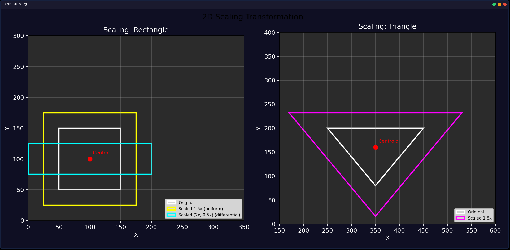

---

## Experiment 9: 3D Rotation About Arbitrary Axis

**Files:** `exp09_3d_rotation.cpp` · `exp09_3d_rotation.py`

### Theory

Rodrigues' rotation formula rotates a point `v` about a unit axis `u` by angle θ:

```
v' = v·cosθ + (u × v)·sinθ + u·(u·v)·(1 - cosθ)
```

### Python Code

```python
import math
import matplotlib.pyplot as plt
from mpl_toolkits.mplot3d import Axes3D

def rotate_about_axis(point, a1, a2, angle):
    px, py, pz = point[0] - a1[0], point[1] - a1[1], point[2] - a1[2]
    ax, ay, az = a2[0] - a1[0], a2[1] - a1[1], a2[2] - a1[2]
    length = math.sqrt(ax*ax + ay*ay + az*az)
    ux, uy, uz = ax/length, ay/length, az/length

    rad = math.radians(angle)
    cos_a, sin_a = math.cos(rad), math.sin(rad)

    dot = px*ux + py*uy + pz*uz
    cross_x = uy*pz - uz*py
    cross_y = uz*px - ux*pz
    cross_z = ux*py - uy*px

    new_x = px*cos_a + cross_x*sin_a + ux*dot*(1 - cos_a)
    new_y = py*cos_a + cross_y*sin_a + uy*dot*(1 - cos_a)
    new_z = pz*cos_a + cross_z*sin_a + uz*dot*(1 - cos_a)

    return (round(new_x + a1[0]), round(new_y + a1[1]), round(new_z + a1[2]))

def draw_cube_3d(ax, vertices, color):
    edges = [(0,1),(1,2),(2,3),(3,0),(4,5),(5,6),(6,7),(7,4),(0,4),(1,5),(2,6),(3,7)]
    xs, ys, zs = zip(*vertices)
    for i, j in edges:
        ax.plot3D(*zip(vertices[i], vertices[j]), color=color, linewidth=1.5)
    ax.scatter(xs, ys, zs, c=color, s=30)

def run():
    cube = [(250,150,-50),(350,150,-50),(350,250,-50),(250,250,-50),
            (250,150,50),(350,150,50),(350,250,50),(250,250,50)]
    a1, a2 = (260,160,-40), (340,240,40)

    rotated_45 = [rotate_about_axis(v, a1, a2, 45) for v in cube]
    rotated_90 = [rotate_about_axis(v, a1, a2, 90) for v in cube]

    fig = plt.figure(figsize=(10, 8))
    ax = fig.add_subplot(111, projection="3d")
    ax.set_title("3D Rotation About Arbitrary Axis (Body Diagonal)")

    draw_cube_3d(ax, cube, "white")
    draw_cube_3d(ax, rotated_45, "yellow")
    draw_cube_3d(ax, rotated_90, "cyan")

    ax.text(0.02, 0.98, 0.98, "White = Original | Yellow = 45deg | Cyan = 90deg\nRotation axis = cube body diagonal",
            transform=ax.transAxes, fontsize=10, verticalalignment="top",
            bbox=dict(boxstyle="round", facecolor="lightcyan", alpha=0.8))

    ax.set_xlabel("X"); ax.set_ylabel("Y"); ax.set_zlabel("Z")
    ax.set_facecolor("#2b2b2b"); fig.patch.set_facecolor("#2b2b2b")
    ax.xaxis.label.set_color("white"); ax.yaxis.label.set_color("white")
    ax.zaxis.label.set_color("white"); ax.title.set_color("white")
    ax.tick_params(colors="white")
    plt.tight_layout()
    plt.show()

if __name__ == "__main__":
    run()
```

### Output

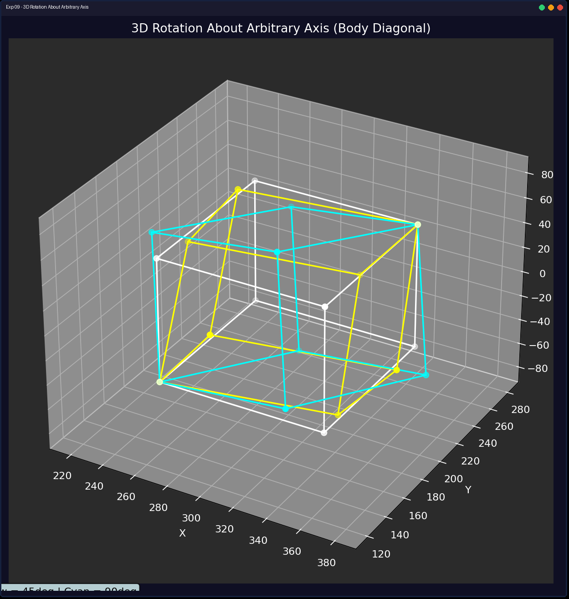

---

## Experiment 10: Cohen-Sutherland Line Clipping

**Files:** `exp10_cohen_sutherland.cpp` · `exp10_cohen_sutherland.py`

### Theory

Each endpoint gets a 4-bit region code (LEFT, RIGHT, BOTTOM, TOP).  
- **Trivial accept:** both codes = 0000  
- **Trivial reject:** codes AND ≠ 0 (both on same outside side)  
- **Otherwise:** clip against one edge, repeat.

```
     1001 | 1000 | 1010
    ──────┼──────┼──────
     0001 | 0000 | 0010
    ──────┼──────┼──────
     0101 | 0100 | 0110
```

### Python Code

```python
import matplotlib.pyplot as plt
import matplotlib.patches as mpatches

INSIDE, LEFT, RIGHT, BOTTOM, TOP = 0, 1, 2, 4, 8
XMIN, YMIN, XMAX, YMAX = 150, 100, 450, 300

def compute_code(x, y):
    code = INSIDE
    if x < XMIN: code |= LEFT
    elif x > XMAX: code |= RIGHT
    if y < YMIN: code |= TOP
    elif y > YMAX: code |= BOTTOM
    return code

def cohen_sutherland_clip(x1, y1, x2, y2):
    code1, code2 = compute_code(x1, y1), compute_code(x2, y2)
    accept = False
    while True:
        if code1 == 0 and code2 == 0:
            accept = True; break
        elif code1 & code2:
            break
        else:
            code_out = code1 if code1 != 0 else code2
            if code_out & TOP:
                x = x1 + (x2 - x1) * (YMIN - y1) / (y2 - y1); y = YMIN
            elif code_out & BOTTOM:
                x = x1 + (x2 - x1) * (YMAX - y1) / (y2 - y1); y = YMAX
            elif code_out & RIGHT:
                y = y1 + (y2 - y1) * (XMAX - x1) / (x2 - x1); x = XMAX
            elif code_out & LEFT:
                y = y1 + (y2 - y1) * (XMIN - x1) / (x2 - x1); x = XMIN
            if code_out == code1:
                x1, y1 = x, y; code1 = compute_code(x1, y1)
            else:
                x2, y2 = x, y; code2 = compute_code(x2, y2)
    if accept:
        return (round(x1), round(y1), round(x2), round(y2))
    return None

def run():
    fig, ax = plt.subplots(figsize=(8, 6))
    ax.set_title("Cohen-Sutherland Line Clipping")
    ax.set_xlim(0, 640); ax.set_ylim(0, 480)
    ax.set_aspect("equal"); ax.grid(True, alpha=0.3)

    ax.add_patch(mpatches.Rectangle((XMIN, YMIN), XMAX-XMIN, YMAX-YMIN, fill=False, edgecolor="white", linewidth=2, label="Clipping Window"))
    ax.text(XMIN+5, YMIN-15, "Clipping Window", color="white", fontsize=8)

    lines = [(50,200,300,80),(500,250,300,350),(100,150,200,250),(50,50,100,80),(500,350,550,400),(200,50,350,50),(500,150,300,200)]
    for x1, y1, x2, y2 in lines:
        ax.plot([x1, x2], [y1, y2], "w-", linewidth=1, alpha=0.4)
    for x1, y1, x2, y2 in lines:
        clipped = cohen_sutherland_clip(x1, y1, x2, y2)
        if clipped:
            ax.plot([clipped[0], clipped[2]], [clipped[1], clipped[3]], "y-", linewidth=2.5)

    ax.text(0.02, 0.98, "White = Original (faded) | Yellow = Visible portion",
            transform=ax.transAxes, fontsize=10, verticalalignment="top",
            bbox=dict(boxstyle="round", facecolor="wheat", alpha=0.8))
    ax.set_xlabel("X"); ax.set_ylabel("Y"); ax.legend(fontsize=8, loc="lower right")
    plt.tight_layout(); plt.show()

if __name__ == "__main__":
    run()
```

### Output

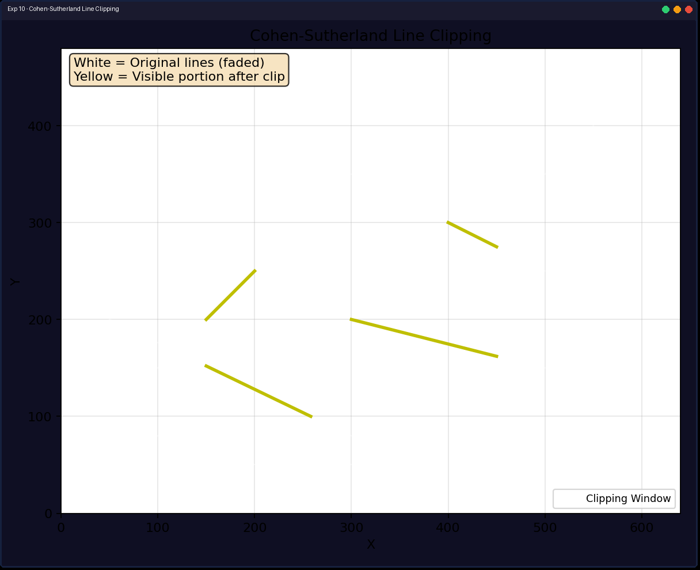

---

## Experiment 11: Sutherland-Hodgman Polygon Clipping

**Files:** `exp11_sutherland_hodgman.cpp` · `exp11_sutherland_hodgman.py`

### Theory

Clip polygon sequentially against left, right, bottom, and top edges. For each edge, process vertex pairs (S → P):

| Case | S inside | P inside | Output |
|------|----------|----------|--------|
| 1 | ✓ | ✓ | P |
| 2 | ✓ | ✗ | Intersection I |
| 3 | ✗ | ✗ | Nothing |
| 4 | ✗ | ✓ | I, then P |

### Python Code

```python
import matplotlib.pyplot as plt
import matplotlib.patches as mpatches

XMIN, YMIN, XMAX, YMAX = 150, 100, 450, 300

def inside(p, edge):
    x, y = p
    if edge == 0: return x >= XMIN
    if edge == 1: return x <= XMAX
    if edge == 2: return y >= YMIN
    if edge == 3: return y <= YMAX
    return False

def intersect(p1, p2, edge):
    x1, y1, x2, y2 = *p1, *p2
    m = (y2 - y1) / (x2 - x1) if x2 != x1 else 1e10
    if edge == 0: return (XMIN, round(y1 + m * (XMIN - x1)))
    if edge == 1: return (XMAX, round(y1 + m * (XMAX - x1)))
    if edge == 2:
        x = round(x1 + (YMIN - y1) / m) if x2 != x1 else x1
        return (x, YMIN)
    if edge == 3:
        x = round(x1 + (YMAX - y1) / m) if x2 != x1 else x1
        return (x, YMAX)
    return (0, 0)

def clip_against_edge(poly, edge):
    if not poly: return []
    result = []
    n = len(poly)
    for i in range(n):
        curr, nxt = poly[i], poly[(i+1)%n]
        ci, ni = inside(curr, edge), inside(nxt, edge)
        if ci and ni: result.append(nxt)
        elif ci and not ni: result.append(intersect(curr, nxt, edge))
        elif not ci and ni:
            result.append(intersect(curr, nxt, edge))
            result.append(nxt)
    return result

def draw_polygon(ax, poly, color, lw=2):
    if len(poly) < 3: return
    xs, ys = zip(*(poly + [poly[0]]))
    ax.plot(xs, ys, color=color, linewidth=lw)

def run():
    fig, ax = plt.subplots(figsize=(8, 6))
    ax.set_title("Sutherland-Hodgman Polygon Clipping")
    ax.set_xlim(0, 640); ax.set_ylim(0, 420)
    ax.set_aspect("equal"); ax.grid(True, alpha=0.3)

    ax.add_patch(mpatches.Rectangle((XMIN,YMIN), XMAX-XMIN, YMAX-YMIN, fill=False, edgecolor="white", linewidth=2, label="Clipping Window"))
    ax.text(XMIN+5, YMIN-15, "Clipping Window", color="white", fontsize=8)

    polygon = [(80,80),(200,50),(350,120),(500,100),(520,250),(400,350),(100,280),(50,200)]
    draw_polygon(ax, polygon, "white", 1.5)

    clipped = polygon[:]
    for edge in range(4):
        clipped = clip_against_edge(clipped, edge)
    draw_polygon(ax, clipped, "yellow", 2.5)

    if clipped:
        cx = sum(p[0] for p in clipped)//len(clipped)
        cy = sum(p[1] for p in clipped)//len(clipped)
        ax.text(cx-20, cy, "Clipped", color="yellow", fontsize=9, fontweight="bold")

    ax.text(0.02, 0.98, "White = Original polygon | Yellow = After clipping",
            transform=ax.transAxes, fontsize=10, verticalalignment="top",
            bbox=dict(boxstyle="round", facecolor="wheat", alpha=0.8))
    ax.set_xlabel("X"); ax.set_ylabel("Y"); ax.legend(fontsize=8, loc="lower right")
    plt.tight_layout(); plt.show()

if __name__ == "__main__":
    run()
```

### Output

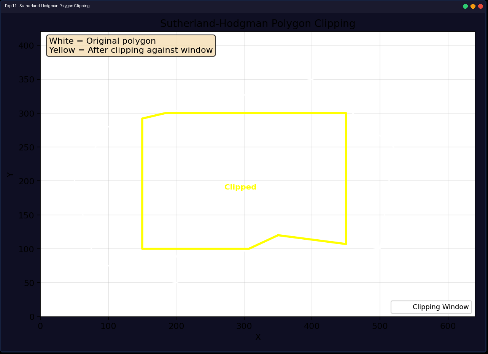

---

## Experiment 12: Bezier Curve

**Files:** `exp12_bezier.cpp` · `exp12_bezier.py`

### Theory

Cubic Bezier curve (4 control points, 0 ≤ t ≤ 1):

```
B(t) = (1-t)³·P₀ + 3t(1-t)²·P₁ + 3t²(1-t)·P₂ + t³·P₃
```

### Python Code

```python
import matplotlib.pyplot as plt
import numpy as np

def bezier_curve(control_x, control_y, steps=100):
    ts = np.linspace(0, 1, steps + 1)
    u = 1 - ts
    b0 = u**3; b1 = 3*ts*u**2; b2 = 3*ts**2*u; b3 = ts**3
    px = b0*control_x[0] + b1*control_x[1] + b2*control_x[2] + b3*control_x[3]
    py = b0*control_y[0] + b1*control_y[1] + b2*control_y[2] + b3*control_y[3]
    return px, py

def draw_control_polygon(ax, x, y):
    ax.plot(x, y, "w--", linewidth=1.5, label="Control polygon")
    ax.scatter(x, y, c="red", s=60, zorder=4)
    for i in range(4):
        ax.annotate(f"P{i}", (x[i], y[i]), xytext=(5,5), textcoords="offset points", color="red", fontsize=9)

def draw_bezier(ax, x, y):
    px, py = bezier_curve(x, y)
    ax.plot(px, py, "y-", linewidth=2.5, label="Bezier curve")

def run():
    fig, (ax1, ax2) = plt.subplots(1, 2, figsize=(12, 5))
    fig.suptitle("Bezier Curve (Cubic)", fontsize=13)

    ax1.set_title("Bezier Curve 1 - S Shape")
    ax1.set_xlim(50, 450); ax1.set_ylim(50, 350)
    ax1.set_aspect("equal"); ax1.grid(True, alpha=0.3)
    draw_control_polygon(ax1, [100,200,300,400], [300,100,100,300])
    draw_bezier(ax1, [100,200,300,400], [300,100,100,300])

    ax2.set_title("Bezier Curve 2")
    ax2.set_xlim(50, 550); ax2.set_ylim(200, 450)
    ax2.set_aspect("equal"); ax2.grid(True, alpha=0.3)
    draw_control_polygon(ax2, [100,250,350,500], [400,250,350,400])
    draw_bezier(ax2, [100,250,350,500], [400,250,350,400])

    for ax in [ax1, ax2]:
        ax.set_xlabel("X"); ax.set_ylabel("Y")
        ax.legend(fontsize=8, loc="upper left")
        ax.set_facecolor("#2b2b2b"); ax.tick_params(colors="white")
        ax.xaxis.label.set_color("white"); ax.yaxis.label.set_color("white")
        ax.title.set_color("white")

    fig.patch.set_facecolor("#2b2b2b")
    plt.tight_layout(); plt.show()

if __name__ == "__main__":
    run()
```

### Output

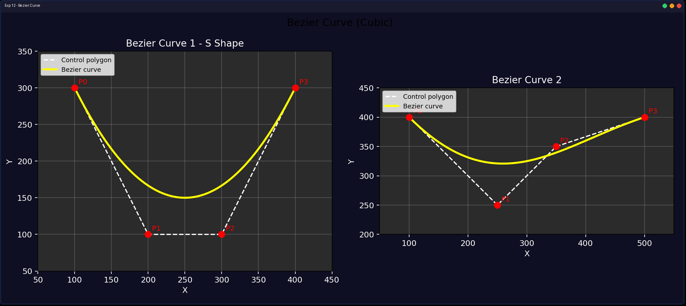

---

## Experiment 13: B-Spline Curve

**Files:** `exp13_b_spline.cpp` · `exp13_b_spline.py`

### Theory

Uniform cubic B-spline — each segment uses 4 control points. Local control: moving one point affects at most 4 segments. C² continuous.

### Python Code

```python
import matplotlib.pyplot as plt
import numpy as np

def b_spline_curve(control_x, control_y, steps=50):
    n = len(control_x)
    all_px, all_py = [], []
    for i in range(n - 3):
        ts = np.linspace(0, 1, steps + 1)
        t2 = ts**2; t3 = ts**3
        b0 = (-t3 + 3*t2 - 3*ts + 1)/6.0
        b1 = (3*t3 - 6*t2 + 4)/6.0
        b2 = (-3*t3 + 3*t2 + 3*ts + 1)/6.0
        b3 = t3/6.0
        px = b0*control_x[i] + b1*control_x[i+1] + b2*control_x[i+2] + b3*control_x[i+3]
        py = b0*control_y[i] + b1*control_y[i+1] + b2*control_y[i+2] + b3*control_y[i+3]
        all_px.extend(px); all_py.extend(py)
    return all_px, all_py

def run():
    fig, ax = plt.subplots(figsize=(8, 6))
    ax.set_title("B-Spline Curve (Uniform Cubic)")

    x = [100, 180, 280, 380, 480, 560]
    y = [200, 80, 300, 80, 300, 200]
    px, py = b_spline_curve(x, y)

    ax.plot(px, py, "y-", linewidth=2.5, label="B-Spline curve")
    ax.plot(x, y, "w--", linewidth=1.5, label="Control polygon")
    ax.scatter(x, y, c="red", s=60, zorder=4)
    for i in range(len(x)):
        ax.annotate(f"P{i}", (x[i], y[i]), xytext=(5,5), textcoords="offset points", color="red", fontsize=9)

    ax.text(0.02, 0.98,
            "White = Control polygon | Red = Control points\n"
            "Yellow = B-Spline curve (C^2 continuous, local control)",
            transform=ax.transAxes, fontsize=9, verticalalignment="top",
            bbox=dict(boxstyle="round", facecolor="lightcyan", alpha=0.8))

    ax.set_xlabel("X"); ax.set_ylabel("Y")
    ax.legend(fontsize=8, loc="upper right")
    ax.grid(True, alpha=0.3); ax.set_aspect("equal")
    ax.set_facecolor("#2b2b2b"); ax.tick_params(colors="white")
    ax.xaxis.label.set_color("white"); ax.yaxis.label.set_color("white")
    ax.title.set_color("white"); fig.patch.set_facecolor("#2b2b2b")
    plt.tight_layout(); plt.show()

if __name__ == "__main__":
    run()
```

### Output

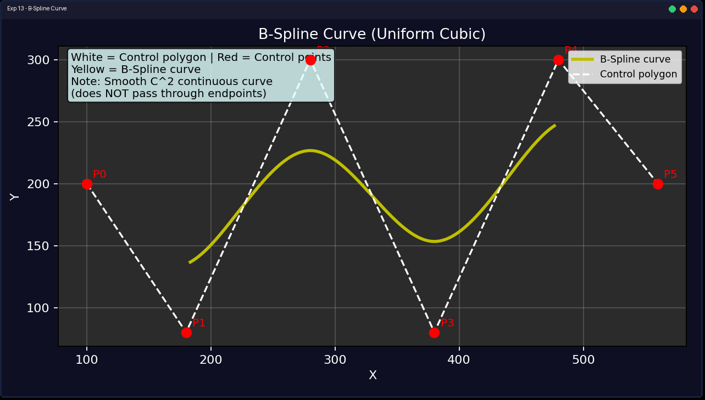

---

## Complete File Reference

| # | Experiment | C++ | Python |
|---|------------|-----|--------|
| 1 | I/O Devices (Theory) | `exp01_io_devices.md` | — |
| 2 | Slope-Intercept Line | `exp02_slope_intercept.cpp` | `exp02_slope_intercept.py` |
| 3 | DDA Line Algorithm | `exp03_dda_line.cpp` | `exp03_dda_line.py` |
| 4 | Bresenham Line Algorithm | `exp04_bresenham_line.cpp` | `exp04_bresenham_line.py` |
| 5 | Midpoint Circle Algorithm | `exp05_midpoint_circle.cpp` | `exp05_midpoint_circle.py` |
| 6 | 2D Translation | `exp06_translation.cpp` | `exp06_translation.py` |
| 7 | 2D Rotation | `exp07_rotation.cpp` | `exp07_rotation.py` |
| 8 | 2D Scaling | `exp08_scaling.cpp` | `exp08_scaling.py` |
| 9 | 3D Rotation About Arbitrary Axis | `exp09_3d_rotation.cpp` | `exp09_3d_rotation.py` |
| 10 | Cohen-Sutherland Line Clipping | `exp10_cohen_sutherland.cpp` | `exp10_cohen_sutherland.py` |
| 11 | Sutherland-Hodgman Polygon Clipping | `exp11_sutherland_hodgman.cpp` | `exp11_sutherland_hodgman.py` |
| 12 | Bezier Curve | `exp12_bezier.cpp` | `exp12_bezier.py` |
| 13 | B-Spline Curve | `exp13_b_spline.cpp` | `exp13_b_spline.py` |

### Utility Files

| File | Purpose |
|------|---------|
| `setup.ps1` | One-time WinBGIm environment setup |
| `menu.ps1` / `menu.bat` | Interactive experiment menu |
| `run.ps1` / `run.bat` | Quick CLI experiment runner |
| `render_all.py` | Regenerate all screenshot images with window frames |
| `frame_screenshot.py` | Add Windows-style window frame to images |
| `include/` | WinBGIm graphics library (headers + lib) |
